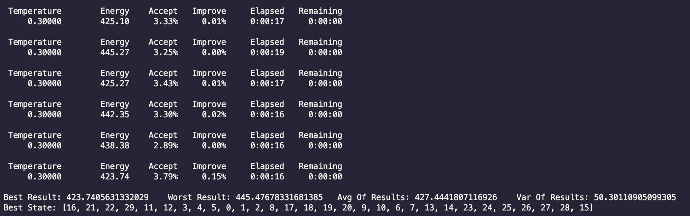

# UsingSimulatedAnnealingAlgorithmToSolveTravellingSalesmanProblem

## 实验内容

在本次实验中，我们选择使用模拟退火算法来求解TSP(Travelling Salesman Problem)问题。

模拟退火算法的实现参考了GitHub上的代码——[https://github.com/perrygeo/simanneal](https://github.com/perrygeo/simanneal)。在此基础上，我们对最后对结果进行了可视化。

## 实验结果

在对超参数进行了一定的尝试和调整后，我们进行了20次随机实验，得到统计结果（平均性能、最佳性能、最差性能、方差）如下图所示：

从图中可以读出，平均结果为427.44，最佳结果为423.74，最差结果为445.48，方差为50.30。

其中较为典型的目标函数变化曲线为：

最优结果的可视化结果如下：

## 实验分析

在实验的过程中，我们能够体会到模拟退火算法的特点。

比如从图中可以看到，目标函数的变化曲线的变化率大致趋势是越来越小的，这是因为刚开始的温度较大，
因此状态的变化几率也比较大，目标函数的波动更大，而随着温度下降，则目标函数趋于稳定。

此外，模拟退火算法对于超参数的选择依赖性也比较强，比如迭代次数的选择，如果选择得比较小，则容易陷入局部
极值点，而如果选择得比较大，则耗费的时间较长。